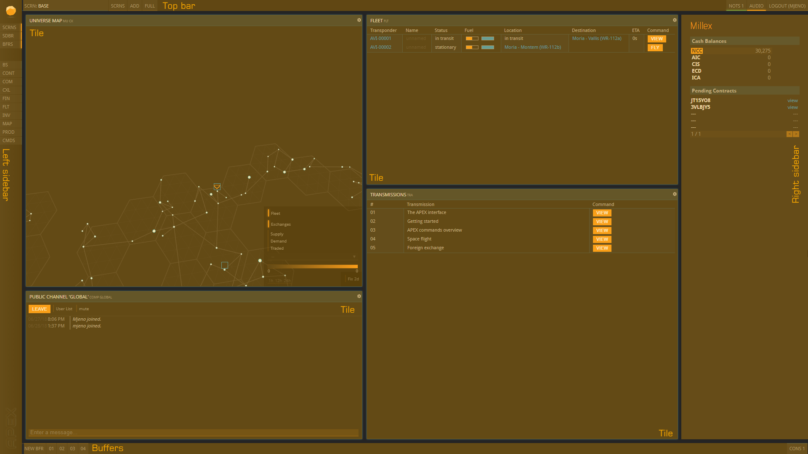
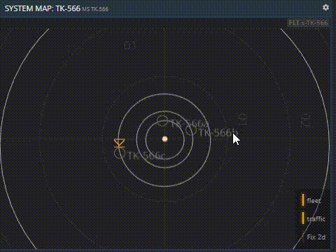
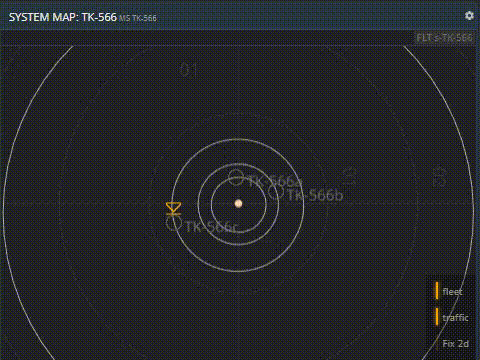
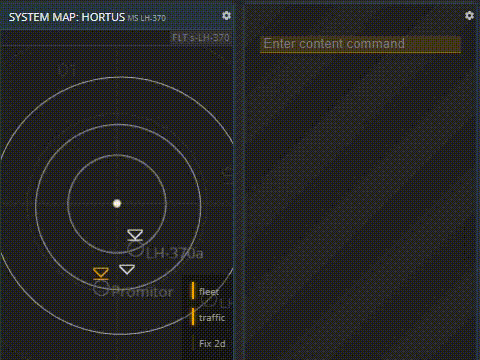
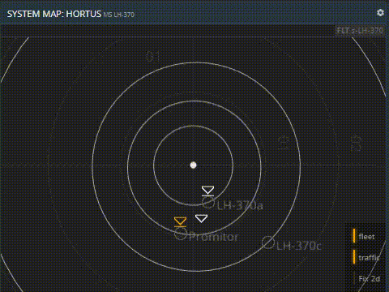
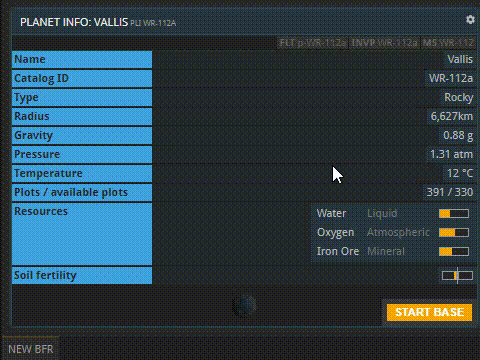
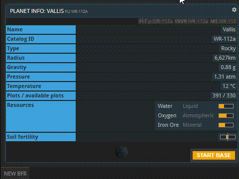
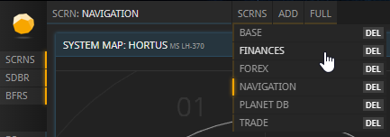

This tutorial will introduce you to the [APEX interface](LINK) (just “APEX” below) and its basic components. It is also available in video format. __Click on the image below to watch the video or scroll down for the written version.__

## Overview

Upon first opening APEX, it looks something like this. Its layout and contents are highly customizable to fit your company’s specific requirements. The basic components, however, are always the same:

## Tiles

Tiles are the most customizable aspect of APEX since you can decide how many of them you want to see, what they show, and how they are organized on your Screen. Tiles show you most of the information you’re going to be interested in, like overviews over the universe, systems, planets, your base, your buildings, your workforce, previous purchases, and much more.

There are several things you can do with tiles. Drag and drop the edge of a tile to resize it.  

Hover over the icon in the top right to get more options.  

You can delete a tile, and the adjacent tile will automatically expand.  

You can delete the content of a tile or you can split it horizontally or vertically to create an empty tile.  

You can overwrite an empty tile by dragging and dropping another tile onto it.  

## Buffers

Buffers are tiles that aren’t fixed into your Screen layout. Instead, they can be dragged around freely. While the Screen is your main workplace, buffers can be opened for short-term uses and quickly closed or minimized. Buffers stay open on top of your Screen even when switching between multiple Screens (see below).

The bar at the bottom is akin to a task bar. It shows which buffers are currently open. Hitting “NEW BFR” or CTRL+Space will open up an empty buffer. Fill it with content by using a command (see below) or by dragging and dropping the content of another buffer or tile onto it.

(The “CONS” button in the bottom right is not related to buffers. Clicking it will show a list of all currently connected users.)

## Commands

At first glance, this feature might appear intimidating. You can use APEX without commands entirely, but they will come in handy as you advance as a user. Commands serve to directly jump to a desired bit of content instead of clicking through a series of links. Every tile and every buffer, even those you did not open via command, corresponds to a specific command. You can see a tile’s command by emptying the tile.

Commands are entered into the command line in an empty tile. The “CMDS” command opens a list of all existing commands. Rather than going through all of them now, keep the [commands overview](../commands-overview) handy to look up specific commands in the future.

## Left sidebar

The left sidebar shows three different kinds of information. Our logo, the APEX Rock, at the top is not just decorative. In its normal state, it stands still. However, if it spins around, something is not working properly. In that case, reloading APEX should solve your problem. After doing so, make sure your last action was processed.

The three buttons below toggle the other side bars on or off.

Below, you can find a customizable list of common commands. Clicking them opens a buffer showing the respective content. By using these shortcuts, you can avoid entering commands yourself. Add or remove commands on this list by Commands that aren’t linked here can be substituted by opening a related command and clicking your way to the desired content. For instance, you can open the Universe map here (“MAP”), then choose a system from there and then click a planet. Each of these actions will enter the correct command automatically.

## Right sidebar (SDBR)

This sidebar on the right shows your account balance in all existing currencies as well as your Pending Contracts. The latter are not important for this introduction.

## Top

The bar at the top says which Screen is currently open. In the example below, it’s a Screen called “BASE”. Hovering over “SCRNS” opens a list of all existing screens. By default, there is a second Screen called “Finances” already set up. Clicking the name of a Screen will open it up.

Hitting “ADD” opens the “Create Screen” buffer, where you can set up a new Screen from scratch and give it a name. The “FULL” button sets APEX to full screen mode.

Keep in mind that any of the tiles of any Screen could just as well be on other Screens and vice versa. How you organize your APEX interface is completely up to you. To carry information over from one screen to another, simply open it in a buffer. Buffers are not tied to a specific Screen.

On the right side, you can find three more elements:
Selecting “NOTS” will open up your notifications, which inform you when a process is finished. Once you receive a new notification, a green light starts flashing here.
“AUDIO” is a toggle button which allows you to enable or disable the sound effect accompanying a new notification.
The LOGOUT button, finally, allows you to sign out. You do not need to sign out every time you close APEX. If you work from a private computer, feel free to stay signed in between sessions.

## More tutorials

If you are first starting out, continue with “Getting started”:  
* [Getting started](LINK)  
* [Space flight](LINK)  
* [Foreign Exchange](LINK)  
* More to come!

Use the arrows below to cycle through all available tutorials in order, from introductory to more and more specific topics.