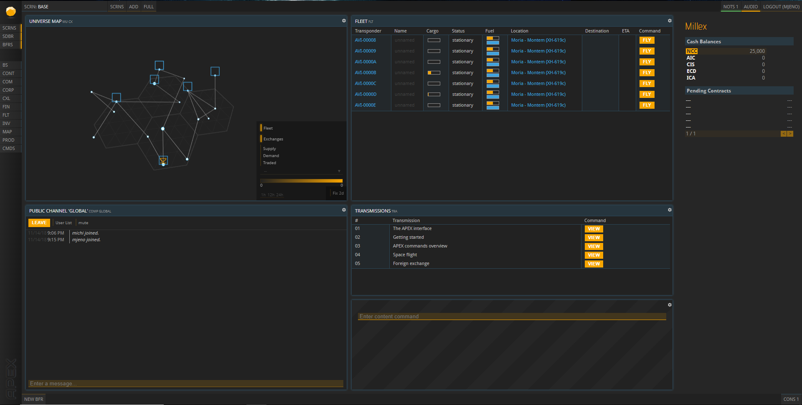
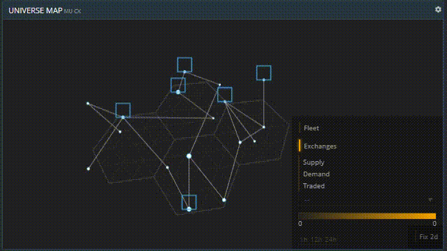
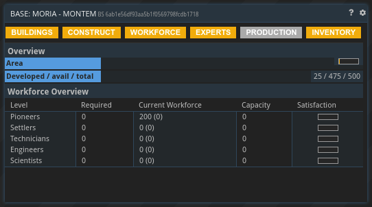
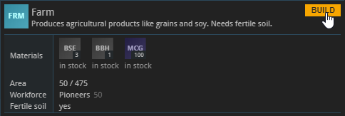

This guide is also available in video format. __Click on the image below to watch the video or scroll down for the written version.__

Follow along the steps below in APEX.

### Choosing a location
After making your choices regarding package, faction, and planet, you get access to APEX. Welcome! Thank you for putting your trust in us. You can now begin setting up your base.

_Please note that the default layout screen may look different for you._

On the Universe Map, you can see an arrow pointing at the system where your starting ships are stationed. If you do not see an arrow, check if there is a yellow bar next to the word “Fleet” in the Universe Map. If there isn’t, click it now to toggle on the display of your Fleet.

Click the system the arrow points to, and the system will open in a new buffer. Now find the planet marked with the same arrow. You can then see a 3D render of your starting planet, and a button for building your base. (If you are a more experienced user already, you may choose to leave your starting location right now and fly to a different one to set up your base there. Just make sure that you will be able to pay the [building costs](../../wiki/building-costs).)

If you want to set up your base right here, which is strongly recommended to new users, click “Construct Base” to see which building materials you need. If it says “missing” underneath some or all of them, click the dropdown menu and select the other ship Transponder code. One of your ships has the resources you need in its cargo hold. Next, choose an empty, grey Plot to place your base module on. Congratulations, you now have a base!

### Building tiers

Clicking “VIEW BASE” opens a buffer you are going to need a lot: your base overview. You may want to drag it into an empty tile right now.

Hitting “Population”, you can see that there are no people in your base yet. Your workforce is divided into several levels of specialization, from Pioneers to Scientists, each with their own needs to stay nourished and active.

Opening up the “SECTIONS” buffer shows that there are no buildings in your base apart from the Core Module. That is why you first need to erect some structures for your workforce to live and work in.

Hit “CONSTRUCT” to see what you can build. Each building entry here provides you with information like its construction costs and the workforce required to operate it. You will notice that this window is organized in multiple tabs. Under “Infrastructure”, you find all buildings that can hold people or goods. The different Habitation Modules harbor different kinds of workers. The Storage Module increases your storage capacity. All the other tabs contain buildings that produce goods, sorted by the kind of workers needed to operate the buildings. (The only exception is the Resources tab. Buildings listed here are operated by Pioneers as well; what makes them special is that they need no input materials to produce goods.)

It is important to understand that the supply chain you decided to start with earlier – Farming, Metallurgy etc. – encompasses buildings in _several_ of these tabs. As a general rule, the more basic buildings of any industry are operated by the lower-level workforces like Pioneers and Settlers, and the further you go to the right, the more advanced the buildings and their workforces become.

_The workforce needed to operate a building is always listed in its info buffer_

### Constructing Sections

Next, you need to find out which buildings are relevant to your company. This depends on the package you picked earlier. If you are new to APEX, you should stick with the structures that are recommended for your package below. You have been provided with the exact materials required to build them, which you will find in one of your ships’ cargo holds. Select the FLT shortcut on the left and click the cargo spaces of your ships to find the materials. Then open your base’s Inventory from the BS window and drag and drop the materials into it from your ship.

Your recommended buildings are listed below and on the [Packages and Factions site](../../wiki/packages-factions). All of them can be found in the Resources and Pioneers tabs:

* Victualler: Rig, Farm, Food Processor  
* Carbon Farmer: 2x Farm, Incinerator  
* Metallurgist: 2x Extractor, Smelter  
* Manufacturer: Collector, Incinerator, Basic Materials Plant  
* Constructor: Basic Materials Plant, Prefab Plant 1  

Regardless of your package, it is recommended that you also construct two “Habitation Pioneer” modules. To construct a building, simply hit its  “BUILD” button; if it worked, your new building will show up in the “SECTIONS” window you can access from your base overview.

You have now successfully started your base with production buildings, worker habitation modules (including the workers) and some storage space. You are all set to begin producing and trading!

_If you are missing construction materials or prefabs (2 BSE in this example), “BUILD” is greyed out_

## About this page

This page is part of the introductory tutorial, which encompasses parts 1 and 2 (2.1-2.5). Use the arrows on the sides to cycle through all available tutorials in order, from introductory to more and more specific topics.

If you encounter an error or cannot find the answers to your questions, we will gladly help you on our [Discord server](https://discordapp.com/invite/G7gj7PT).