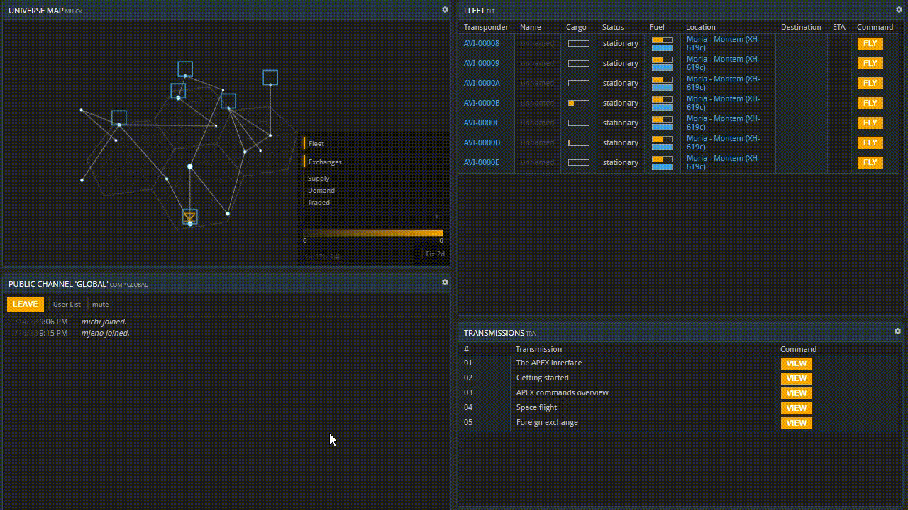
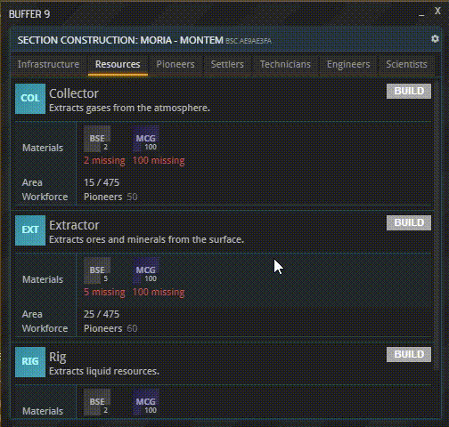
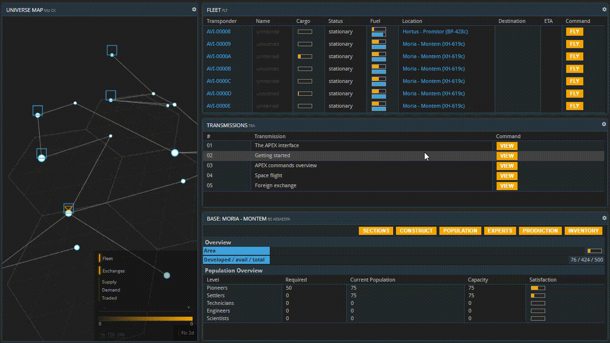

This guide will teach you all you need to know to get your company off the ground [APEX interface](LINK) (just “APEX” below). It is also available in video format. __Click on the image below to watch the video or scroll down for the written version.__

Follow along the steps below in APEX.

### Company name & code

When logging into APEX for the very first time, you are asked to provide the name and code of your company. The name you choose must not violate APEX’s terms of service, meaning that if it isn’t offensive or too similar to the name of an already existing company, anything is possible. The code is an abbreviation, an identifier, used for looking up your company within APEX. It must be four letters long and, like the company name, it needs to be unique.

### Factions
Next, you get to pick which faction you want to belong to. Picking a faction will not limit where you can go or what you can do with your company. All factions peacefully coexist and won’t harm you if you want to do trade in another faction’s territory. However, factions reign over certain sections of space, each with their own currency and set of rules.

Joining a faction means that you can set up your first base on a planet it controls, which is the most immediate consequence of picking a faction at this point. Planets have different properties which help with or impede certain trades. For example: The Moria system, which is controlled by Neo Charter Exploration, provides better conditions for anything related to mining due to its mineral-rich planets. The Insitor Cooperative, meanwhile, specializes more in food production because that is what the planets in the Hortus System lend themselves to.	

### Planet

The next step is picking the planet on which to set up your company. Selecting one in the dropdown menu provides you with further information: Each planet is subdivided into bits of land called Plots. Each company claims exactly one plot on a planet; if no plot is available, the planet is full and you need to pick another one. You can also see a list of resources that can be extracted from this planet as well as an indicator of how fertile the planet is, meaning how easy or hard it is to grow plants there. The further the yellow bar goes to the right, the better the planet is suited for farming.

The line titled “Commodity Exchange” is very important: If it says “none”, no goods can be traded on this planet. If you build your base on a planet without a Commodity Exchange, you will need to send ships to a planet that has a Commodity Exchange in order to buy or sell anything. This means that trading gets more expensive because you need to account for the fuel required for shipping. You will also need to wait several hours for the things you purchased to arrive, including the very basic construction materials you need to set up your base and start working. On the other hand, you might have access to a more fertile environment or rare minerals on your planet that other traders will pay good money for. If this is your first time using APEX, it is strongly recommended that you pick a planet with its own Commodity Exchange.

### Package
Lastly, APEX wants to know what kind of company you will be running, i.e. in which supply chain you will be operating. This will impact which resources you will be provided by APEX to help build your structures at the start. It will also determine which type of experts will be made available to you. You can change your profession at any later point in time, but it is going to take time to make that change and develop experts in a new discipline. The choice you make now is going to impact your company’s direction for a while.

### Base setup
After making your choices, you get access to APEX. Welcome! Thank you for putting your trust in us. You can now begin setting up your base.

_Please note that the default layout screen may look different for you._

On the Universe Map, you can see an arrow pointing at the system where your starting ships are stationed. If you do not see an arrow, check if there is a yellow bar next to the word “Fleet” in the Universe Map. If there isn’t, click it now to toggle on the display of your Fleet.

Click the system the arrow points to, and the system will open in a new buffer. Now find the planet marked with the same arrow. You can then see a 3D render of your starting planet, and a button for building your base. (If you are a more experienced user already, you may choose to leave your starting planet right now and fly to a different one to set up your base there. Just make sure that your starting planet is of the “Rocky” type and its temperature lies between –25 and +75 degrees Celcius, or you might not be able to afford the construction materials required to survive in such a harsh environment.) If, however, you want to set up your base right here, which is strongly recommended if you are new, click “Construct Base” to see which building materials you need. If it says “missing” underneath some or all of them, click the dropdown menu and select the other ship Transponder code. One of your ships has the resources you need in its cargo hold. Next, choose an empty, grey Plot to place your base module on. Congratulations, you now have a base!

### Building tiers

Clicking “VIEW BASE” opens a buffer you are going to need a lot: your base overview. You may want to drag it into an empty tile right now.

Hitting “Population”, you can see that there are no people in your base yet. Your workforce is divided into several levels of specialization, from Pioneers to Scientists.

Opening up the “SECTIONS” buffer shows that there are no buildings in your base apart from the Core Module. That is why you first need to erect some structures for your workforce to live and work in.

Hit “CONSTRUCT” to see what you can build. Each building entry here provides you with information like its construction costs and the workforce required to operate it. You will notice that this window is organized in multiple tabs. Under “Infrastructure”, you find all buildings that can hold people or goods. The different Habitation Modules harbor different kinds of workers. The Storage Module increases your storage capacity. All the other tabs contain buildings that produce goods, sorted by the kind of workers needed to operate the buildings. (The only exception is the Resources tab. Buildings listed here are operated by Pioneers as well; what makes them special is that they need no input materials to produce goods.)

It is important to understand that the supply chain you decided to start with earlier – Farming, Metallurgy etc. – encompasses buildings in _several_ of these tabs. As a general rule, the more basic buildings of any supply chain are operated by the lower-level workforces like Pioneers and Settlers, and the further you go to the right, the more advanced the buildings and their workforces become. Now let’s see which buildings are relevant to your company.

_The workforce needed to operate a building is always listed in its info buffer_

### Constructing Sections

Which structures you need depends on the package you picked earlier. If you are new to APEX, you should stick with the structures that are recommended for your package. You have been provided with the required materials to build them, which you will find in one of your ships’ cargo holds. Select the FLT shortcut on the left and click the cargo spaces of your ships to find the materials. Then open your base’s Inventory from the BS window and drag and drop the materials into it from your ship.

Your recommended buildings can be found in the Pioneers and Resources tabs. Recommendations are as follows:

* Victualler: Rig, Farm, Food Processor  
* Carbon Farmer: 2x Farm, Incinerator  
* Metallurgist: 2x Extractor, Smelter  
* Plastics Manufacturer: Collector, Incinerator, Basic Materials Plant  
* Constructor: Basic Materials Plant, Prefab Plant 1  

Regardless of your package, it is recommended that you also construct two “Habitation Pioneer” modules. To construct a building, simply hit its  “BUILD” button; if it worked, your new building will show up in the “SECTIONS” window you can access from your base overview.

You have now successfully started your base with production buildings, worker habitation modules (including the workers) and some storage space. You are all set to begin producing and trading!

_If you are missing construction materials or prefabs (2 BSE in this example), “BUILD” is greyed out_

## More tutorials

* [APEX overview](LINK)  
* [Space flight](LINK)  
* [Foreign Exchange](LINK)  
* More to come!

Use the arrows on the sides to cycle through all available tutorials in order, from introductory to more and more specific topics.