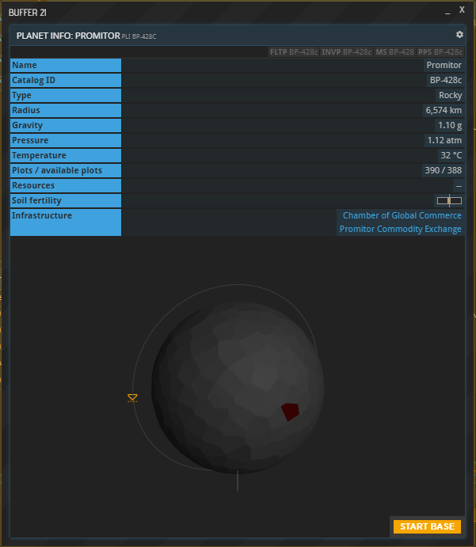
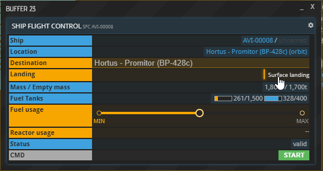

This tutorial is also available in video format. __Click on the image below to watch the video or scroll down for the written version.__

### Contracts

If the commodities you bought are in none of your inventories yet, you now have to go and get them. This happens when neither your base nor any of your ships are currently at the location where you made the purchase. The moment you made your first purchase, a contract popped up in the sidebar. (If you cannot see the sidebar, you can toggle it on by clicking “SDBR” on the left.) Click a contract ID to see more information.

Alternatively, you can open a list of your contracts by using the “CONTS” command. Next, click “view” to open the details of a contract, and you will see that the units you ordered have been reserved for you and are awaiting pick-up. The button labeled “Fulfill” is greyed out because you have no ship at the location to pick the cargo up with, so you have to send one.

You are now going to learn the exact steps required to pick up your cargo. For more extensive information on the subject of space travel, check out the [Space flight tutorial](/../space-flight). If your Fleet window is not open yet, bring it up now using the FLT command shortcut in the left sidebar, then open one of your ships’ cargo holds by clicking its cargo space. Note that a ship’s cargo space is limited, and for bigger purchases it might be necessary to send multiple ships. Your cargo hold is limited by the available space (in cubic meters) and maximum weight of its contents.

In the Contract buffer that opens up, you can see the target planet’s ID:

Now hit the “FLY” button next to the desired ship's entry in the Fleet window to bring up the Ship Flight Control. Copy the target planet's ID into the Flight Control’s Destination field and then set the fuel usage. The higher the fuel usage, the sooner your spacecraft will arrive, but setting it to one-hundred percent means that it won’t have a drop of fuel left to return home and the trip would be unreasonably expensive. Note that, depending on the distance of your trip, you may not be able to spend 100 % of your fuel.

In any case, the flight will take several hours during which you cannot do anything but wait. Your ship’s position is tracked in the System Map and Universe Map as a yellow triangle. If you do not see it, toggle on “fleet” in the bottom right corner.

Once your ship has arrived, the Fulfill buttons of the active contracts you have at your target location will turn green. If they don’t, the reason might be that the target market is on the planet surface and your ship is still in orbit.

To fix that, select the ship’s FLY button in the Fleet window again, enter the ID of the planet it is orbiting, check “Planetary landing” and select “START” once more.

By now, the “Fulfill” buttons on the active contracts you have on that market should have turned green. Click them to load up your ship with the goods you purchased and send it home the same way you sent it out before. Once it arrives at your home base, make sure to drag and drop the materials you purchased from its cargo space into your Base’s inventory.

