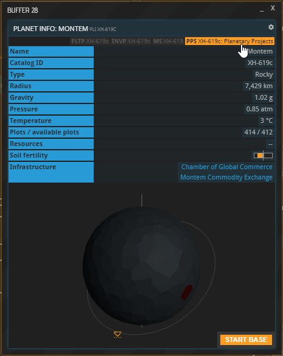
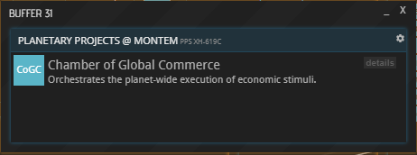
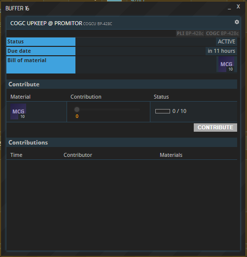
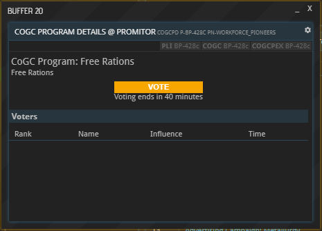

This tutorial is also available in video format. __Click on the image below to watch the video or scroll down for the written version.__

## Introduction

Planetary projects are collectively erected and maintained structures that provide a bonus to the inhabitants of a planet. If projects are present on a planet, they will be listed under “Infrastructure” in the PLI window as well as the PPS window (accessible at the top of the PLI window).

Clicking “details” next to an entry in the PPS window will reveal more information on that project.

## Building a planetary project

New planetary projects can be initiated by anybody with a base on the respective planet. To do so, open the planet’s PPS window and select “contribute” next to the desired planetary project.

In the new project window - the project being a CoGC in this example -, you can track the cost of building the project, the progress that has been made towards its construction, and the individual contributions made by inhabitants of the planet. Use the sliders to select the size your contribution.

Once all contributions have been filled by the planet’s inhabitants, the finished project will become visible as a green plot on the planet. Clicking the plot will open a new buffer about the project.

## Planetary project types

Once built, a planetary project requires an upkeep to stay active. As long as the upkeep is not being paid, the project remains “on strike” and provides no bonuses. Similarly to the construction of a planetary project, contributions towards its upkeep can be made by anyone residing on the planet in question.

To contribute, open the project’s buffer by clicking its name under “Infrastructure” or its plot on the planet (in a PLI window). Under “Upkeep”, select “contribute”. In the new window, set the slider(s) to the desired amount and hit “CONTRIBUTE”. Your contribution will be listed at the bottom along with all other recently made contributions.

As long as their upkeep is paid, the different planetary projects currently available will provide different kinds of advantages to a planet’s inhabitants.

### Chamber of Global Commerce (CoGC)

A Chamber of Global Commerce can run a variety of programs to stimulate a planet’s economy. Open the buffer of a CoGC by clicking its name under “Infrastructure” or its plot on the planet (in a PLI window). In the new COGC window that opened up, you can see the CoGC’s current and upcoming programs listed under “Programs”.

To vote on the upcoming program, select “programs / vote” to view a list of all available programs.

Click a program’s name or the respective “view details / vote” button learn more about it. Hit “Vote” to give your vote to the desired program; the one with the most votes will be listed as the upcoming program in the planet’s COGC buffer. 

## More tutorials

If you are first starting out, continue with “Getting started”:  
* [Getting started](LINK)  
* [Space flight](LINK)  
* [Foreign Exchange](LINK)  
* More to come!

Use the arrows on the sides to cycle through all available tutorials in order, from introductory to more and more specific topics.